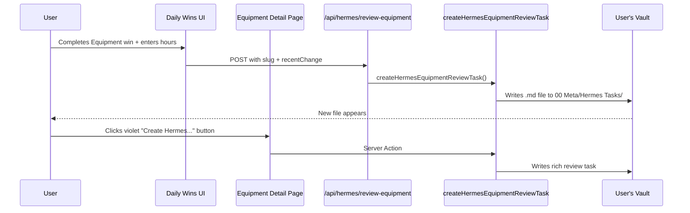

# The Forge Hermes Trigger System
## How Updates Flow from Daily Work → Hermes Review Tasks

**Date**: February 2026  
**Status**: Live & Operational  
**Purpose**: Visual reference to understand (and show off) the new bidirectional trigger system between The Forge and Hermes.

---

## The Core Idea

The Forge is the **daily action surface**.  
The Obsidian vault is the **single source of truth**.  
**Hermes** is the deep research & standardization engine.

Previously: Updating an Equipment Card (especially via Daily Wins) required manual copy-paste of standards and context every time you wanted Hermes to review it.

**Now**: The Forge can **automatically generate** a rich, context-aware Hermes review task file and drop it directly into your vault when you make real updates.

This is the missing "trigger" connection.

---

## High-Level Flow (Visual)

```mermaid
flowchart TD
    A[User Action in Forge] --> B{Where?}
    
    B -->|Daily Wins| C[Log Equipment Maintenance + Enter Hours]
    B -->|Equipment Detail Page| D[Click "Create Hermes Standardization Review Task"]
    
    C --> E[Forge detects Equipment update]
    D --> E
    
    E --> F[API or Server Action calls createHermesEquipmentReviewTask]
    
    F --> G[Generates rich .md task file]
    G --> H[Written to vault:<br/>00 Meta/Hermes Tasks/]
    
    H --> I[User opens the generated file in Obsidian]
    I --> J[Copies content → sends to Hermes]
    
    J --> K[Hermes reviews against the new<br/>Maintenance Schedule + Service Instructions standard]
    K --> L[Returns improved card sections]
    L --> M[User pastes back into source Equipment Card]
    
    style H fill:#fef3c7,stroke:#d97706
    style C fill:#d1fae5,stroke:#059669
    style D fill:#dbeafe,stroke:#2563eb
```

---

## Detailed Trigger Points

### 1. Daily Wins (Most Powerful Trigger)

**Location**: `/daily-wins`

**Flow**:
1. User adds an Equipment maintenance item (e.g. "TTR110 (KTM) — Basic Service" or "JD2150 — Oil & Filter")
2. User checks it complete in Today's Plan
3. System prompts for new current hours (this already updates the Equipment Card via `updateShopEquipmentHours`)
4. **New behavior**: Immediately after entering hours, the user is offered:
   > "Would you like to create a Hermes Review Task for this right now?"

5. If accepted → POST to `/api/hermes/review-equipment` with:
   - Real slug
   - Exact recent change ("Hours updated to 1,860h via Daily Wins...")
   - Context: triggeredFrom = "Daily Wins"
   - Focus areas tied to the new standard

**Result**: A timestamped, context-rich task file appears in the vault ready for Hermes.

---

### 2. Equipment Detail Page (Direct Control)

**Location**: `/shop/equipment/[slug]`

**UI Element**:
- Prominent violet button in the sidebar (below the hours update form):
  > **📋 Create Hermes Standardization Review Task**

**What it captures**:
- Current card snapshot (full content)
- Date
- Optional recent change note
- Explicit focus on the two new mandatory sections:
  - `## Maintenance Schedule` (structured 10% rule data)
  - `## Service Instructions` (actionable steps for Daily Wins)

This button is especially useful right after you manually update hours or notes.

---

## What a Generated Hermes Task Looks Like

Example filename (auto-created):
`2026-02-03 - Hermes Standardization Review - TTR110 (KTM).md`

**Inside the file** (generated by the system):

```markdown
# Hermes Review Task: Standardize TTR110 (KTM) Against New Daily Wins Requirements

**Date**: 2026-02-03
**Equipment**: TTR110 (KTM) (slug: TTR110 (KTM))
**Priority**: High
**Focus**: Maintenance Schedule structure + Service Instructions quality

**Recent Change Detected**: Hours updated to 312h via Daily Wins on 2026-02-03 — Basic service completed

**Triggered from**: Daily Wins

## Context (for Hermes)

You must review this specific card against the standards defined in these two documents:

1. Forge Systems - Daily Wins & Equipment Maintenance Standardization.md
2. Hermes Task - Standardize All Equipment Cards for Daily Wins.md

### Primary Requirements
- Add/rewrite `## Maintenance Schedule` using the exact structured format
- Add/rewrite `## Service Instructions` with field-usable steps
- Make the card feed the 10% rule and "View notes" experience in Daily Wins

## Current Card Snapshot
---
[Full current markdown of the Equipment Card is embedded here]
---

## Output Instructions
Please return the full updated card + summary of changes.
```

The file is self-contained — the user just has to attach the two spec documents and send it.

---

## Architecture (Components Involved)



**Key Files**:
- `lib/vault.ts` → `createHermesEquipmentReviewTask()` (the core engine)
- `app/api/hermes/review-equipment/route.ts` → API surface for client triggers
- `app/daily-wins/page.tsx` → Best trigger point (after real work)
- `app/shop/equipment/[slug]/page.tsx` → Direct trigger button + hours update synergy
- `app/hermes/page.tsx` → Dedicated hub explaining the whole system

---

## Before vs After

| Aspect                        | Before                                      | After (Current System)                          |
|-------------------------------|---------------------------------------------|-------------------------------------------------|
| Triggering Hermes reviews     | Manual copy-paste of standards + card       | One click or automatic prompt after real work   |
| Context in prompts            | User had to remember + paste manually       | Automatically includes recent change + standard references |
| Location of review requests   | Scattered in chat history                   | Organized in `00 Meta/Hermes Tasks/` in vault   |
| Connection to Daily Wins      | None                                        | Tight integration — updates automatically offer review |
| "Open in Obsidian" buttons    | Multiple deep links in UI                   | Removed (Forge is the action surface)           |
| Philosophy alignment          | Weak                                        | Strong — Forge triggers deep work via vault files |

---

## Design Philosophy Reinforced

- **Forge** = Where you *do* the work (log wins, update hours, trigger reviews).
- **Obsidian vault** = Where everything lives long-term + where you send work to Hermes.
- **Hermes** = Deep thinking and standardization against the official specs.
- No more "Open in Obsidian" escape hatches for daily action.

---

## How to Show This Off

1. Open this document in Obsidian (it has nice Mermaid diagrams).
2. Walk through the flow starting from **Daily Wins**.
3. Complete a real Equipment maintenance item → watch the Hermes task file appear in `00 Meta/Hermes Tasks/`.
4. Open the generated file and show how rich the context is.

This system is one of the cleanest bridges we've built between daily execution and long-term intelligence in The Forge.

---

*Document generated to celebrate the Hermes Trigger System implementation — February 2026.*
